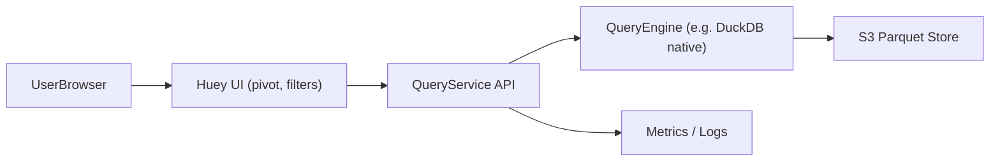
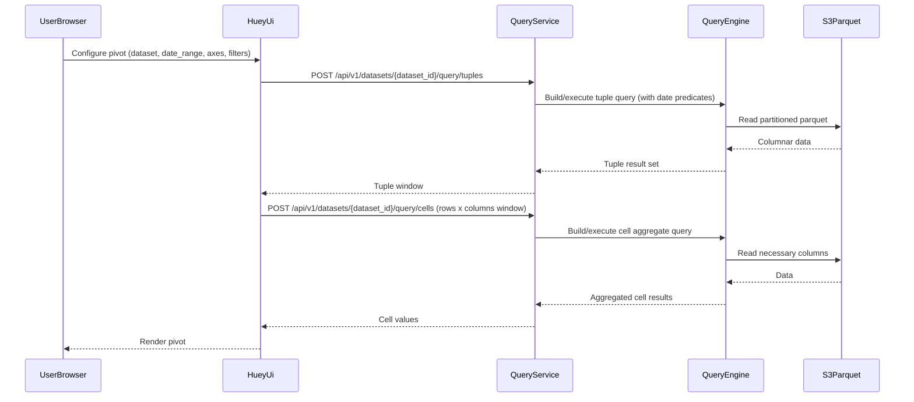

## Huey Large-Scale OLAP – Architecture and Implementation Roadmap

This document describes the target architecture for evolving Huey into a large-scale OLAP UI over S3-backed parquet, and a phased implementation roadmap.

### Backend stack

The QueryService is implemented with:

- **Language / runtime**: Python 3.x
- **API framework**: FastAPI (HTTP/JSON, async request handling)
- **Analytical engine**: DuckDB (embedded in-process via the `duckdb` Python package; reads parquet from S3 or local paths)

This stack keeps the service simple to deploy (single process), aligns with Huey’s existing DuckDB dialect for SQL generation, and supports S3-backed parquet via DuckDB’s native and extension capabilities.

### 1. Logical Architecture

At a high level:

- Huey remains a static browser-based UI and query builder.
- A new backend **QueryService** executes queries against an analytical engine connected to S3.
- The engine performs scanning, filtering, grouping, and aggregation, exploiting partition pruning and predicate pushdown.

#### 1.1 Component overview

- **Huey UI**
  - Existing static webapp.
  - Gains a **RemoteDatasource** path that calls QueryService instead of DuckDB-WASM for large remote datasets.

- **QueryService**
  - Stateless HTTP API.
  - Responsibilities:
    - Authentication and lightweight authorization.
    - Request validation (dataset, date_range, query shape).
    - Query routing to the engine.
    - Mapping engine result sets to the tuple/cell/picklist/export APIs.
    - Exposing metrics and logs for observability.

- **QueryEngine**
  - Implemented as **DuckDB embedded in-process** within each QueryService process (see Backend stack above). No separate engine tier in the initial design.
  - Responsibilities:
    - Reading parquet from S3 (or equivalent).
    - Applying partition pruning and predicate pushdown.
    - Executing aggregations, group-bys, and other OLAP operations.

- **S3/Object Store**
  - Stores partitioned parquet data per dataset and date.
  - Provides scalable, durable storage.

- **Metrics/Logs backend**
  - Receives metrics and logs from QueryService.
  - Supports dashboards and alerting.

#### 1.2 Data flow (typical pivot)

High-level sequence:

1. User configures a pivot in Huey (dataset, date_range, rows, columns, measures, filters).
2. Huey sends a `/api/v1/datasets/{dataset_id}/query/tuples` request to QueryService to fetch row and column headers.
3. QueryService builds or validates an engine query:
   - Enforces `WHERE date BETWEEN ...` based on date_range.
   - Applies filter predicates.
4. QueryEngine runs the query:
   - Reads only the relevant date partition(s) from S3.
   - Computes grouped tuples and, optionally, grouping IDs for totals.
5. QueryService returns a tuple window to Huey.
6. Huey sends `/api/v1/datasets/{dataset_id}/query/cells` to obtain cell values for a given window of row and column tuples.
7. QueryEngine runs an aggregate query to compute cell values.
8. QueryService returns cells; Huey renders the pivot.
9. On scroll, Huey requests additional windows; QueryService reuses engine and data paths.

### 2. Deployment Topology

Two primary deployment options are considered for the relationship between QueryService and QueryEngine.

#### 2.1 Option A – Embedded engine per service instance

- Each QueryService instance:
  - Embeds a DuckDB (or similar engine) process.
  - Maintains in-memory state and connections to S3.
- Pros:
  - Simple deployment (single binary/container).
  - No network hops between service logic and engine.
  - Easier local development.
- Cons:
  - Scaling QueryService and engines are tied together.
  - Memory usage per instance may grow; more careful tuning needed.

#### 2.2 Option B – Dedicated engine worker pool

- QueryService:
  - Stateless front-end API.
  - Delegates queries to a pool of engine worker processes or a query server.
- Pros:
  - Engine tier can scale independently.
  - Easier isolation of heavy queries or noisy tenants.
- Cons:
  - More complex orchestration.
  - Additional network hops and coordination requirements.

The choice between Option A and Option B can be made based on organizational preferences and scale; both are compatible with the specification.

### 3. Data Flow Diagrams

#### 3.1 High-level component diagram

#### 3.2 Typical pivot sequence

### 4. Failure Modes and Handling

- **Backend unavailable**
  - Huey:
    - Shows a clear “service unavailable” message for remote datasets.
    - Optionally offers local/WASM mode for small files (if configured).
  - QueryService:
    - Exposes health endpoints and error responses so load balancers can route appropriately.

- **Query timeout**
  - QueryService:
    - Enforces per-query timeouts; returns a timeout error with guidance.
  - Huey:
    - Surfaces a user-friendly message suggesting narrower date ranges, fewer dimensions, or reduced cardinality.

- **Schema evolution issues**
  - QueryService:
    - Detects incompatible type changes; returns structured errors.
  - Huey:
    - Indicates which fields are unavailable or incompatible for a given date_range.

- **S3 throttling or transient errors**
  - QueryService:
    - Applies limited retries with backoff.
    - Emits metrics and logs for operator visibility.

### 5. Implementation Roadmap

This roadmap assumes incremental delivery with testable pieces in each phase.

#### Phase 1 – Documentation and Design

- Finalize:
  - Business Requirements Document (BRD).
  - Technical Specification (Tech Spec).
  - Architecture document (this file).
- Decisions:
  - Engine choice (for example, DuckDB).
  - Deployment option (embedded vs separate engine tier).
  - Initial SLAs and concurrency targets.

Deliverables:

- Versioned `docs/huey-large-scale-olap-brd.md`.
- Versioned `docs/huey-large-scale-olap-tech-spec.md`.
- Versioned `docs/huey-large-scale-olap-architecture.md`.

#### Phase 2 – Backend Foundations (MVP QueryService)

**Epic 1: Bootstrap QueryService**

- Create a new service project (for example, `query-service` repository or subproject).
- Implement basic HTTP handling, configuration loading, and CI pipeline.
- Add `/health` endpoints and structured logging.

**Epic 2: Engine and S3 integration**

- Integrate the chosen analytical engine (for example, DuckDB) into QueryService.
- Configure S3 access (endpoints, credentials).
- Implement a simple `SELECT COUNT(*)` over a single-day partition to validate connectivity and minimal performance.

**Epic 3: Tuple queries**

- Implement `POST /api/v1/datasets/{dataset_id}/query/tuples`:
  - Support single-dimension grouping, day-scoped queries, limit/offset.
  - Apply filters and date predicates.
- Add tests using synthetic data approximating 50 GB/day partitions.

#### Phase 3 – Huey Integration (RemoteDatasource path)

**Epic 4: Remote datasource support**

- Define configuration UI (or configuration file) for remote datasets:
  - API base URL.
  - Dataset IDs.
- Implement `RemoteDatasource` in Huey:
  - Calls `/api/v1/datasets/{dataset_id}/schema` for attribute lists.
  - Calls `/api/v1/datasets/{dataset_id}/query/tuples` and `/api/v1/datasets/{dataset_id}/query/cells` to drive the pivot table.
- Feature flag:
  - Allow switching between local/WASM and remote modes per dataset.

**Epic 5: Filter UI integration**

- Wire Filter UI picklists to `/api/v1/datasets/{dataset_id}/query/picklist`.
- Ensure global filters are propagated to all tuple and cell requests.
- Optimize picklist paging, search behavior, and user feedback.

#### Phase 4 – Performance, UX, and Hardening

**Epic 6: Performance tuning**

- Benchmark day-scoped queries on realistic 50 GB partitions:
  - Vary dimensions, measures, and cardinality.
- Implement caching where beneficial:
  - Schema metadata.
  - Partition lists.
  - Hot date partitions and common aggregates.
- Add timeouts and clear error messages for slow or large queries.

**Epic 7: Exports and saved views**

- Implement `/api/v1/exports` endpoint and background export jobs.
- Wire Huey’s export capabilities to remote exports:
  - Respect row/size limits.
  - Avoid overloading the browser with large downloads.
- Ensure saved views or URL fragments remain compatible with the remote backend.

**Epic 8: Security and observability**

- Integrate authentication (for example, JWT validation middleware).
- Implement dataset-level authorization rules.
- Enhance metrics and logging:
  - Dashboards for latency, throughput, error rates.
  - Alerts for S3 errors, timeouts, and saturation.

#### Phase 5 – Rollout and Feedback

**Epic 9: Pilot rollout**

- Onboard one or two high-value datasets and a limited set of power users.
- Collect:
  - Performance data.
  - User feedback on UX and query responsiveness.
- Iterate on:
  - Guardrails (for example, warnings for large date ranges).
  - Defaults (for example, default date ranges, sample views).

**Epic 10: General availability**

- Document:
  - User guides for analysts.
  - Operator runbooks (deployments, incident response).
- Harden:
  - Backup and recovery strategies for configuration and logs.
  - Observability practices (dashboards and alerts).
- Roll out to broader user base and treat feature as generally available.
